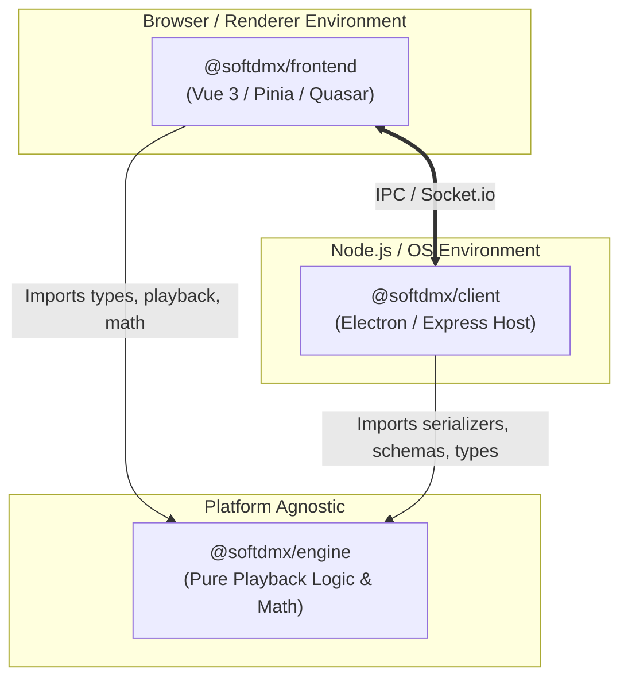

# SoftDMX Architecture Memory

This document provides a comprehensive guide to the architecture of SoftDMX, detailing how the shared playback engine, the Electron runtime client, and the Vue 3 user interface are structured and how they communicate.

---

## 1. Architectural Overview

SoftDMX is organized as a yarn-based monorepo containing three core packages:



### Module Guidelines & Constraints
* **`@softdmx/engine` (Pure Core)**: Must remain completely platform-agnostic. It cannot import Node.js native standard libraries (`node:fs`, `node:dgram`, etc.) or native Node packages. This constraint ensures it can run seamlessly both in the browser (Vue app) and in Node.js (Electron main process).
* **`@softdmx/frontend` (UI Layout & Controls)**: Houses the visual interface, animations, themes, and reactive state stores. It consumes `@softdmx/engine` directly for light desks, playback calculations, and user interactions.
* **`@softdmx/client` (Hardware & OS Host)**: Governs low-level operations. It manages physical serial ports (DMX USB), networking (Art-Net / sACN sockets), native file lookups, local configuration storage, and companion server endpoints.

---

## 2. Package Responsibility Breakdown

The division of labor across the packages is strictly enforced to maintain testability and isolation:

| Feature / System | Shared Engine (`@softdmx/engine`) | Frontend UI (`@softdmx/frontend`) | Client Host (`@softdmx/client`) |
| :--- | :--- | :--- | :--- |
| **DMX Playback Math** | priority merging, LFOs, fade calculations, master fader scaling | Playback timing triggers, visual progress tracking, Pinia bindings | Driver packet emissions, output refresh loops |
| **Fixture Profiles** | GDTF byte parser, YAML parsers, mode channel resolvers | UI fixture-profile wizards, visual fixture editor, Vite glob asset loader | Local disk profile scanner, OS directory watcher |
| **Showfiles** | Schema validations, document type specs, migrations, serialization | Interactive show file editing, local storage caching, UI-driven undo/redo | OS filesystem reads/writes, automatic background backups |
| **I/O Protocols** | MTC (MIDI Timecode) byte parser, OSC packet structure validation | WebMIDI API connectors, UI controllers mapping | UDP network sockets, virtual MIDI ports, native serial ports |
| **Video & Pixel Maps** | Color samplers, math grids, pixel allocation vectors | Video player components, mapping layout editors, Canvas renderers | Video file stream handlers, GPU-accelerated texture targets |

---

## 3. Package Deep Dives

### 📂 `@softdmx/engine`
Located under `packages/engine/`, this is a fully headless, pure-logic playback and parsing suite.

* **`/src/core`**: Playback engines (`stack-playback.ts`, `cue-playback.ts`), math and layout engines (`align-wings.ts`), pixel routing grids, attribute configurations, and prioritization layers (`layers/`).
* **`/src/show`**: Versioning, data structures (`document.ts`), standard validations (`io.ts`), and schemas required to build, load, and migrate (`migrate.ts`) show projects.
* **`/src/fixture-library`**: Core profile serializers, raw YAML translators, and GDTF (General Device Type Format) zip/XML parsers.
* **`/src/utils`**: General-purpose lighting industry logic (timecode format calculations, link-LFO models, sync calculations, pan/tilt angle translations).

### 📂 `@softdmx/frontend`
Located under `packages/frontend/`, this is a responsive Single Page App (SPA) built with Vue 3, Quasar, and Pinia.

* **Reactive State (`src/stores/`)**: High-level reactive engines (e.g., `dmx.ts` and `output-playback.ts`) tracking live-editor values. They evaluate cues using imports from `@softdmx/engine` and stream state to the user's monitor and the Electron backend.
* **Themes (`src/themes/`)**: Entirely frontend-only constructs. They define UI color palettes, layouts, and custom CSS modifiers without polluting the mathematical DMX core.
* **Loader (`src/fixture-library/loader.ts`)**: Harnesses Vite's browser-safe runtime mechanics (such as dynamic asset imports and bundle-level YAML glob matching) to fetch and unpack bundled fixture assets in the browser environment.

### 📂 `@softdmx/client`
Located under `packages/client/`, this is the Node.js/Electron main process orchestrating local servers and operating system integration.

* **Output Drivers (`src-electron/output/`)**: Physical network socket integrations such as `ArtNetDriver`, `SacnDriver`, and native serial ports like `DmxUsbProDriver`.
* **OS File Scanning (`src-electron/fixture-lookup.ts`)**: Leverages `node:fs` to scan the local machine's disk folders for custom GDTF and YAML files, building a native registry on startup.
* **Express & WebSockets (`src-electron/server/`)**: Boots a localized Socket.io server to bridge command events, showfile synchronizations, and raw channel values directly into the output drivers.

---

## 4. The Decoupled Lookup Delegation Pattern

A common challenge in a decoupled frontend/backend architecture is resolving fixture definitions. Playback math inside `@softdmx/engine` needs to retrieve fixture configurations by ID, but the engine has no native knowledge of where profiles live. 

* On the **Frontend**, profiles are retrieved via a browser bundle loader using Vite glob paths.
* On the **Client**, profiles are read from the machine's local storage directory using native Node `node:fs` calls.

To solve this, the engine employs a **Delegation Lookup Pattern** inside [lookup.ts](../packages/engine/src/fixture-library/lookup.ts):

```typescript
// packages/engine/src/fixture-library/lookup.ts
import type { FixtureDefinition } from '../types/fixture';

let fixtureLookup: (id: string) => FixtureDefinition | undefined = () => undefined;

export function setFixtureLookup(lookup: (id: string) => FixtureDefinition | undefined): void {
  fixtureLookup = lookup;
}

export function getFixtureDefinition(id: string): FixtureDefinition | undefined {
  return fixtureLookup(id);
}
```

### How to use the delegation lookup:
1. **Engine Core Usage**: Internal engine files (such as `preset-resolver.ts`) call `getFixtureDefinition(fixtureId)` whenever they need to unpack modes or channels.
2. **Environment Registration**:
   * During boot, the consuming application calls `setFixtureLookup()` to register its environment-specific resolver strategy.
   * For the browser app, register the frontend reactive registry's lookup helper.
   * For the Electron app, register the local filesystem lookup watcher.

> [!TIP]
> This pattern completely isolates the calculation logic of `@softdmx/engine` from environment quirks, keeping the core pure, lightweight, and 100% testable under standard JS runners.

---

## 5. Development and Testing Setup

### Monorepo Alias Hooking
During ESM test executions (e.g. executing frontend tests via Mocha), unresolved absolute and specifier paths are intercepted dynamically. 

The monorepo utilizes an ESM loader hook ([resolve-src-hook.mjs](../packages/frontend/test/helpers/resolve-src-hook.mjs)) to translate speculation paths (such as `src/engine/*`, `src/show/*`, `src/types/*`) on the fly directly to their new home in `@softdmx/engine`. This keeps all legacy tests functional and green without forcing tedious import refactors across thousands of lines of code.

### Build and Compilation Target
The compilation of the workspace targets clean Modern ESM (`ESNext`), utilizing bundler-based module resolution settings (`allowImportingTsExtensions` and `resolveJsonModule`) to guarantee efficient tree-shaking and rapid compile times in Rolldown and Vite.
