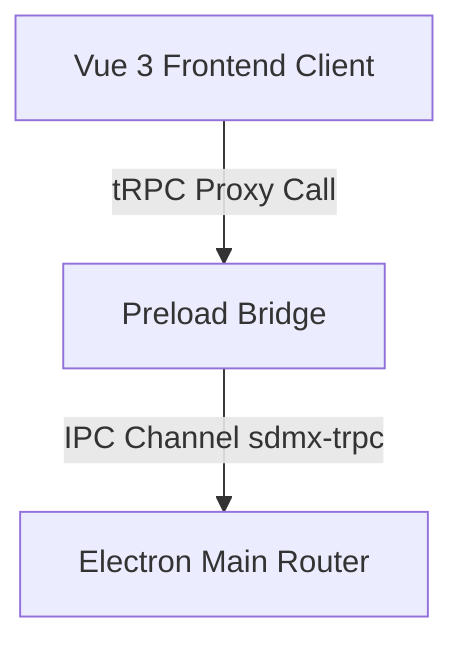

/*
 * Copyright (C) 2025-Present booploops and contributors
 *
 * This Source Code Form is subject to the terms of the Mozilla Public
 * License, v. 2.0. If a copy of the MPL was not distributed with this
 * file, You can obtain one at https://mozilla.org/MPL/2.0/.
 */

# tRPC Electron IPC & Native Menus

This document explains the design, architecture, and usage of the **tRPC Electron IPC** system in SoftDMX. tRPC is used to establish a fully type-safe, asynchronous communication bridge between the Electron Main (backend) and the Vue 3 Renderer (frontend).

---

## 🏗️ Architecture Overview

The system is powered by `electron-trpc-experimental`. It establishes communication across the Electron IPC boundary in three layers:



### 1. Main Process Router (`@softdmx/client`)
* **Path**: `packages/client/src-electron/ipc/trpc-router.ts`
* Defines backend procedures (queries, mutations, subscriptions).
* Subscriptions are used for persistent, stream-based interaction (like native menus which remain open and trigger callbacks sequentially).

### 2. Preload Bridge (`@softdmx/client`)
* **Path**: `packages/client/src-electron/electron-preload.ts`
* Imports and invokes `exposeElectronTRPC()`.
* Exposes a secure, limited-access IPC hook (`window.electronTRPC`) to the main world without exposing any native Node.js standard libraries.

### 3. Frontend Client (`@softdmx/frontend`)
* **Path**: `packages/frontend/src/lib/trpc.ts`
* Constructs a proxy client with the backend router type metadata:
  ```typescript
  import { createTRPCProxyClient } from "@trpc/client";
  import { ipcLink } from "electron-trpc-experimental/renderer";
  import type { AppRouter } from "src-electron/ipc/trpc-router";

  export const trpc = createTRPCProxyClient<AppRouter>({
    links: [ipcLink()],
  });
  ```

---

## 📋 Creating and Triggering Native Menus

Native Electron context menus (like right-click context menus or spawn menus) are constructed dynamically by translating frontend template arrays into native Electron `Menu` configurations on the backend, and streaming back clicks as push events over a tRPC subscription.

### Template Definition (`FrontendMenuItem`)
A frontend menu item is structured using the global `FrontendMenuItem` type (defined in `packages/frontend/src/env.d.ts`):
```typescript
interface FrontendMenuItem {
  label?: string;
  type?: 'normal' | 'separator' | 'submenu' | 'checkbox' | 'radio';
  role?: string;
  enabled?: boolean;
  visible?: boolean;
  checked?: boolean;
  click?: () => void;
  submenu?: FrontendMenuItem[];
}
```

### How to Trigger a Menu from Vue Components
We serialize the callbacks into temporary string identifiers (`clickId`) on the frontend, register the local click triggers in a callback map, and open a subscription to the backend tRPC router.

Example from `WorkspaceLayout.vue`:
```typescript
import { trpc } from 'src/lib/trpc';

function showNativeContextMenu(template: FrontendMenuItem[], x?: number, y?: number) {
    const clickCallbacks = new Map<string, () => void>();
    let nextClickId = 0;

    const serializeTemplate = (items: FrontendMenuItem[]): any[] => {
        return items.map((item) => {
            const serialized: any = { ...item };
            delete serialized.click;

            if (item.click) {
                const clickId = `click-${nextClickId++}`;
                clickCallbacks.set(clickId, item.click);
                serialized.clickId = clickId;
            }

            if (item.submenu) {
                serialized.submenu = serializeTemplate(item.submenu);
            }
            return serialized;
        });
    };

    const serialized = serializeTemplate(template);

    const subscription = trpc.showContextMenu.subscribe(
        { template: serialized, x, y },
        {
            onData(event) {
                if (event.type === 'click') {
                    const cb = clickCallbacks.get(event.clickId);
                    if (cb) cb();
                } else if (event.type === 'close') {
                    // Subscription teardown & callback disposal
                    setTimeout(() => {
                        clickCallbacks.clear();
                        subscription.unsubscribe();
                    }, 100);
                }
            },
            onError(err) {
                console.error('Menu error:', err);
                clickCallbacks.clear();
            },
        }
    );
}
```

---

## ⚠️ Important Implementation Details & Gotchas

### 1. The `Symbol.asyncDispose` Conflict
In modern JavaScript engines (Node.js 20+ and Chromium), built-in generator/iterator objects (like `AsyncGenerator` returned by `async function*`) natively implement `Symbol.asyncDispose` to support standard `await using` syntax.

However, the experimental `electron-trpc-experimental` package includes a rigid check:
```typescript
if (it[Symbol.asyncDispose]) {
  throw new Error('Symbol.asyncDispose already exists');
}
```
This forces any native generator returned directly by a subscription to throw a runtime `TRPCClientError: Symbol.asyncDispose already exists` error.

#### The Fix: Plain `AsyncIterable` Wrapper
Always wrap native generators returned by backend subscription procedures in `toPlainAsyncIterable()` helper inside `trpc-router.ts`:
```typescript
function toPlainAsyncIterable<T>(iterable: AsyncIterable<T>): AsyncIterable<T> {
  return {
    [Symbol.asyncIterator]() {
      const iterator = iterable[Symbol.asyncIterator]();
      return {
        async next() {
          return iterator.next();
        },
        async return() {
          if (iterator.return) {
            return iterator.return();
          }
          return { done: true, value: undefined as any };
        }
      };
    }
  };
}
```
This wrapper strips the `Symbol.asyncDispose` prototype property from the returned iterable handle while maintaining standard subscription cleanup capabilities (by forwarding `return` signals perfectly).

### 2. Side-Effect Free Constraint
Keep all tRPC router definitions inside `packages/client/src-electron/`. **Do not** import anything from `@softdmx/client`'s electron paths into `@softdmx/engine` or `@softdmx/frontend` as this violates bundling constraints and breaks browser-only deployments.
