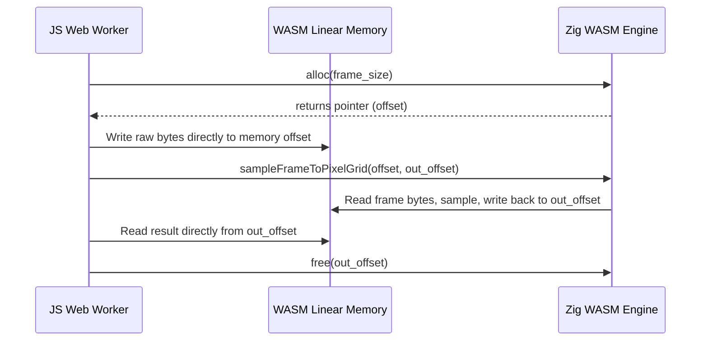

# WebAssembly (WASM) Usage Guide

This document describes **when**, **why**, and **how** to use the `@softdmx/wasm` WebAssembly module for computationally heavy tasks in our realtime lighting console application. It serves as a guide for both human reviewers and developer agents to maintain consistent high-performance practices.

---

## 1. Why WebAssembly?

Realtime lighting consoles require extremely low latency and rock-solid timing stability. The standard DMX transmission rate is **44Hz** (approximately **22.7ms per frame**), and physical output drivers expect a jitter-free feed of channel values. 

While V8 and modern JavaScript engines are exceptionally fast, they have two main pain points:
1. **Garbage Collection (GC) pauses**: Periodic garbage collection sweeps can cause frame processing times to spike, leading to dropped frames or stuttering fades.
2. **Main Thread Blocking**: Running heavy computations (e.g., mapping video frames to hundreds of DMX pixel matrices) on the main thread blocks UI interactions and rendering.

By using a **freestanding Zig module** compiled to WebAssembly running inside **Web Workers**, we completely decouple computational pipelines from both the main UI thread and standard JS heap allocation churn.

---

## 2. When to Use WASM vs. Pure JS/TS

Avoid using WebAssembly for simple control flows or lightweight operations where the overhead of Worker context-switching overrides any performance benefits.

### Use WebAssembly (WASM) for:
* **Pixel Mapping & Sampling**: Realtime sampling of high-resolution video frames down to low-resolution fixture grids (e.g., LED video walls).
* **Massive Engine Playback Math**: Simultaneously calculating priority merges (HTP/LTP), fading, and high-frequency LFO waveforms for tens of thousands of DMX channels.
* **Bulk Binary Parsing**: Parsing large, binary-intensive files (such as complex GDTF ZIP archives or binary OSC message packets) at high speeds.
* **Array Transformations**: Heavy math operations over flat, typed numeric arrays where loops can be vectorized or unrolled by the compiler.

### Use Pure JS/TS (`@softdmx/engine`) for:
* **Control Flow & Application Logic**: Light desks, UI navigation, and user command-line syntax parsing.
* **Showfile Structure**: Creating, serializing, and migrating JSON-based show files.
* **Event Handlers**: Listening to WebSocket, MIDI, or network socket triggers.
* **Driver Communication**: Instantiating hardware protocols (Art-Net, sACN, USB-DMX serial) which are inherently tied to OS-level system APIs.

---

## 3. Zero-Copy Memory Model

The single most critical performance optimization in `@softdmx/wasm` is the **Zero-Copy Memory Model**. Copying large buffers (like a 1080p video frame) back and forth between the JS heap and WASM linear memory is highly inefficient and creates significant garbage collection overhead.

Instead, we use a single shared block of WebAssembly memory:



### Key Principles of Zero-Copy in SoftDMX:
1. **Manual Allocation**: The host JS code calls the exported Zig `alloc(size)` function to obtain an offset (pointer) within the WASM memory buffer.
2. **Direct Buffer Writing**: The host creates a `Uint8Array` view targeting `wasmExports.memory.buffer` at the allocated pointer, and copies the source data directly into it.
3. **In-Place Computation**: The WASM module performs mathematical operations on the inputs and writes the output directly into a designated output buffer (also allocated in WASM linear memory).
4. **Buffer Transfer**: The host copies the resulting slice into a transferred buffer and returns it via `postMessage` using Worker **Transferables**, ensuring the memory is shifted between threads with zero copy cost.

---

## 4. The Freestanding Zig Implementation

The WASM module is written in **Zig**, targetted to freestanding WebAssembly (`wasm32-freestanding`). Because it is freestanding, there are no OS dependencies or native filesystem wrappers.

The allocator is initialized to the standard `std.heap.page_allocator`:

```zig
// packages/wasm/src/main.zig
const std = @import("std");

var allocator = std.heap.page_allocator;

export fn alloc(size: usize) ?[*]u8 {
    const buf = allocator.alloc(u8, size) catch return null;
    return buf.ptr;
}

export fn free(ptr: ?[*]u8, size: usize) void {
    if (ptr) |p| {
        allocator.free(p[0..size]);
    }
}
```

### Frame Sampling Example
The core computation loops are written using standard pointers:

```zig
export fn sampleFrameToPixelGrid(
    frame_width: u32,
    frame_height: u32,
    frame_data: [*]const u8,
    map_width: u32,
    map_height: u32,
    region_x: f32,
    region_y: f32,
    region_width: f32,
    region_height: f32,
    flip_y: bool,
    out_rgb: [*]u8,
) void {
    // Math loops to map coordinates and read from frame_data array directly
    // and write results into out_rgb ...
}
```

---

## 5. Web Worker Integration Template

In the browser/frontend environment, the WASM module is imported and instantiated within a Web Worker.

Below is the established pattern modeled from [video-sampler.worker.ts](file:///Volumes/Storage/Repos/GitHub/softdmx/packages/frontend/src/workers/video-sampler.worker.ts):

### Initialization and Allocation Caching
```typescript
import wasmUrl from '@softdmx/wasm/dist/softdmx.wasm?url';
import type { SoftDmxWasmExports } from '@softdmx/wasm';

let wasmInstance: WebAssembly.Instance | null = null;
let wasmExports: SoftDmxWasmExports | null = null;

// Cache buffers to prevent allocator thrashing during a 44Hz loop!
let cachedFramePtr: number = 0;
let cachedFrameSize: number = 0;

async function initWasm() {
  if (wasmInstance) return;
  const response = await fetch(wasmUrl);
  const bytes = await response.arrayBuffer();
  const result = await WebAssembly.instantiate(bytes, { env: {} });
  wasmInstance = result.instance;
  wasmExports = wasmInstance.exports as SoftDmxWasmExports;
}
```

### High-Performance Processing Routine
```typescript
function processSample(frameWidth: number, frameHeight: number, frameData: ArrayBuffer, maps: any[]) {
  if (!wasmExports) return;

  const frameBytes = new Uint8Array(frameData);

  // 1. Manage allocation caching: only re-allocate if the incoming frame is larger
  if (cachedFrameSize < frameBytes.length) {
    if (cachedFramePtr) {
      wasmExports.free(cachedFramePtr, cachedFrameSize);
    }
    cachedFrameSize = frameBytes.length;
    cachedFramePtr = wasmExports.alloc(cachedFrameSize);
  }

  // 2. Map view and set bytes directly in WASM memory
  const wasmFrameBuffer = new Uint8Array(
    wasmExports.memory.buffer,
    cachedFramePtr,
    frameBytes.length
  );
  wasmFrameBuffer.set(frameBytes);

  const samplesObj: Record<string, any> = {};
  const transferList: Transferable[] = [frameData]; // Transfer input buffer back to release thread hold

  for (const map of maps) {
    const outSize = map.width * map.height * 3; // RGB output
    const outPtr = wasmExports.alloc(outSize);

    // 3. Compute in Zig WASM
    wasmExports.sampleFrameToPixelGrid(
      frameWidth, frameHeight, cachedFramePtr,
      map.width, map.height,
      map.region.x, map.region.y, map.region.width, map.region.height,
      map.flipY ?? false,
      outPtr
    );

    // 4. Extract outputs
    const outBuffer = new Uint8Array(wasmExports.memory.buffer, outPtr, outSize);
    const transferredBuffer = outBuffer.slice().buffer; // Copy slice to allow thread transfer

    samplesObj[map.id] = {
      width: map.width,
      height: map.height,
      buffer: transferredBuffer
    };
    
    // Transfer target output buffer
    transferList.push(transferredBuffer);

    // 5. Clean up temporary output pointers immediately
    wasmExports.free(outPtr, outSize);
  }

  // 6. Post back to main thread with Zero-Copy Transfer list
  self.postMessage({
    type: 'sampled',
    samples: samplesObj,
    frameData: frameData
  }, transferList);
}
```

---

## 6. Critical Rules & Constraints for Developer Agents

When modifying, extending, or calling `@softdmx/wasm`, adhere strictly to these constraints:

### 1. Pointer Caching
> [!IMPORTANT]
> **Never allocate input buffers on every single frame tick.**
> Constant allocation and deallocation will fragment the heap and degrade performance. Always cache large input pointers (e.g. video frames) and only re-allocate (`free` followed by `alloc`) when the incoming payload size increases.

### 2. Immediate Cleanup of Temporary Outputs
> [!WARNING]
> Because WebAssembly is freestanding, there is **no garbage collection** inside Zig. Any memory allocated via `alloc` that is not reused MUST be manually deallocated using `free` as soon as the host is done extracting the bytes. Memory leaks in WASM will silently crash the worker.

### 3. Handle Memory Buffer Invalidation
> [!CAUTION]
> In WebAssembly, growing memory (`memory.grow()`) allocates a new buffer and invalidates any existing JavaScript references (e.g., `Uint8Array` views). 
> **Rule:** Always instantiate your typed array views (`new Uint8Array(wasmExports.memory.buffer, ...)`) **immediately** before reading or writing data. Do not cache the typed array views across asynchronous calls or function cycles.

### 4. Freestanding Zig Math Safety
> [!TIP]
> Ensure all calculations inside Zig are range-checked. Division-by-zero, negative array indices, or float-to-int overflow in freestanding Zig can cause immediate WASM panics, which halts execution without a stack trace. Always validate input bounds prior to calculation.
