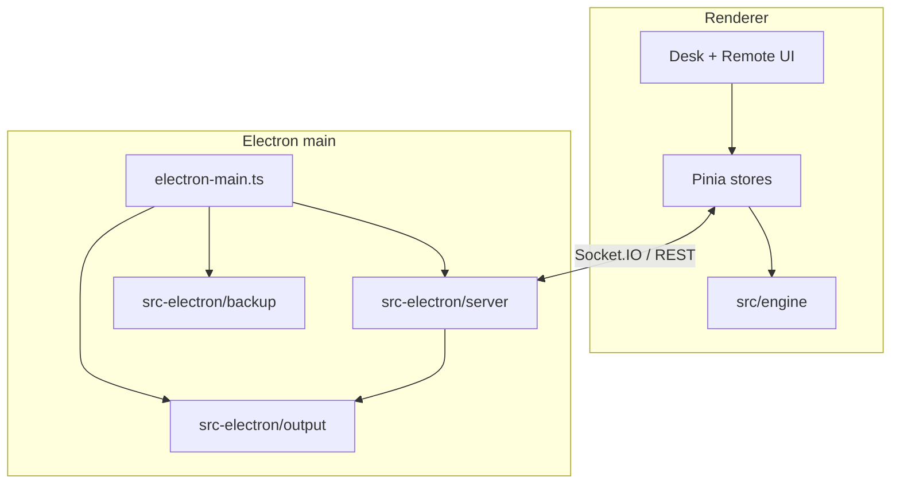

# Architecture

SoftDMX is an Electron app: a Vue/Quasar renderer talks to a Node main process over Socket.IO and REST. The DMX merge engine is plain TypeScript with no Vue imports.

## Process layout

| Layer | Path | Role |
|-------|------|------|
| Renderer | `src/` | Desk UI, remote page, widgets |
| Engine | `src/engine/` | Layer merge, cues, effects, video/audio mapping |
| Show model | `src/show/` | `ShowDocument` types, YAML I/O, migration |
| Fixtures | `src/fixture-library/` | Bundled and user YAML/GDTF fixtures |
| Main process | `src-electron/` | HTTP server, DMX drivers, backup, video IPC |

## Show files (`src/show/`)

- `document.ts` — schema
- `io.ts` — parse and serialize YAML
- `migrate.ts` — upgrade older versions to `1.5`
- `version.ts` — supported version constants

## Engine (`src/engine/`)

Pure TypeScript. Key areas: layer merge (`layers/`, `types.ts`), cue/stack playback, effects, preset resolution, audio/video mapping, pixel sampling.

## Server (`src-electron/server/`)

Started from `bootstrap.ts`:

- Fastify — static assets and REST (`api/remote-rest.ts`)
- Socket.IO — channels (`socket/channels.ts`), remote control (`socket/remote.ts`), settings (`socket/settings.ts`)

Default port: `5353`.

## Output (`src-electron/output/`)

Art-Net, sACN, GridNode, and USB DMX via `output-manager.ts`. Primary/standby pairing lives in `src-electron/backup/`.

## Desk modes

Top-level modes in the master bar:

| Mode | Purpose |
|------|---------|
| Live | Busking views and playback rail |
| Timeline | Set timeline editor |
| Program | Presets, cues, effects, executors |
| Setup | Patch, video mapping, show file |

Older docs may refer to tab names like Channels, Groups, Widgets, Presets, Show, and Patch. Those map to windows inside the current modes rather than separate top-level tabs.

## Boot files (`src/boot/`)

`device-io-init.ts` (MIDI/OSC/link), `remote-api.ts` (remote client), plus Quasar framework overrides.
