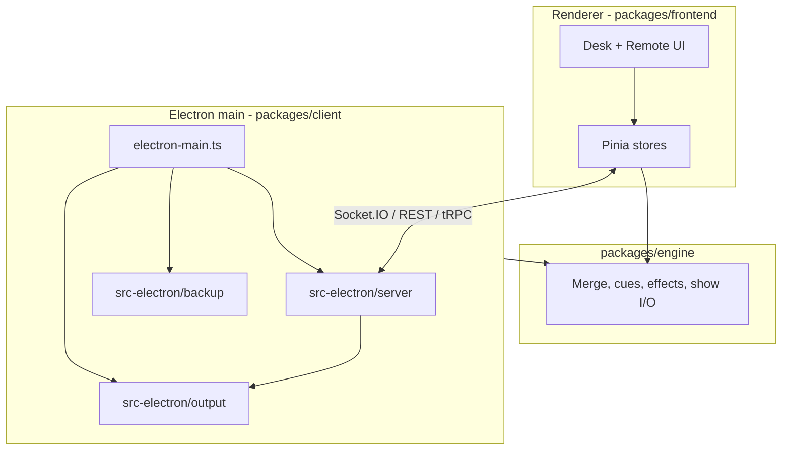

# Architecture

SoftDMX is a Yarn 4 monorepo. A Vue/Quasar renderer (`@softdmx/frontend`) talks to an Electron main process (`@softdmx/client`) over Socket.IO, REST, and tRPC. Playback math and show I/O live in `@softdmx/engine` (plain TypeScript, no Vue or Node APIs). Hot-path merge helpers can run in Zig WASM (`@softdmx/wasm`).

## Process layout

```mermaid
flowchart TB
  subgraph renderer [Renderer - packages/frontend]
    UI[Desk + Remote UI]
    Stores[Pinia stores]
  end

  subgraph enginePkg [packages/engine]
    Engine[Merge, cues, effects, show I/O]
  end

  subgraph electron [Electron main - packages/client]
    Main[electron-main.ts]
    Server[src-electron/server]
    Output[src-electron/output]
    Backup[src-electron/backup]
  end

  UI --> Stores
  Stores --> Engine
  Stores <-->|Socket.IO / REST / tRPC| Server
  Server --> Output
  Main --> Server
  Main --> Output
  Main --> Backup
  electron --> Engine
```

| Package | Path | Role |
|---------|------|------|
| `@softdmx/frontend` | `packages/frontend/` | Desk UI, remote page, Pinia stores, bundled shows/fixtures |
| `@softdmx/engine` | `packages/engine/` | Layer merge, cues, effects, show YAML I/O, fixture/GDTF model |
| `@softdmx/client` | `packages/client/` | Electron shell, Hono/Socket.IO server, DMX drivers, backup, video IPC |
| `@softdmx/wasm` | `packages/wasm/` | Zig → WASM hot-path helpers |
| `@softdmx/shared` | `packages/shared/` | Shared Zod/config types |
| `@softdmx/tests` | `packages/tests/` | Vitest, Playwright, fuzz, and golden fixtures |
| `@softdmx/buffers` | `packages/buffers/` | FlatBuffers schema (minimal today) |

`packages/server` and `packages/conduit` exist as stubs and are not part of the production desk path yet.

## Show files (`packages/engine/src/show/`)

- `document.ts` — schema
- `io.ts` — parse and serialize YAML
- `migrate.ts` — upgrade older versions to `1.6`
- `version.ts` — `CURRENT_SHOW_VERSION` and supported versions

## Engine (`packages/engine/src/`)

Pure TypeScript. Key areas: layer merge (`core/`), cue/stack playback, effects, preset resolution, audio/video mapping, pixel sampling, programmer bake/replay. Fixture YAML/GDTF live under `fixture-library/`.

## Server (`packages/client/src-electron/server/`)

Started from `bootstrap.ts`:

- **Hono** — static assets and REST (`api/remote-rest.ts`)
- **Socket.IO** — channels (`socket/channels.ts`), remote control (`socket/remote.ts`), settings (`socket/settings.ts`)

Default port: `5353`.

## Output (`packages/client/src-electron/output/`)

Art-Net, sACN, GridNode, and USB DMX via `output-manager.ts`. Primary/standby pairing lives in `packages/client/src-electron/backup/`. Universe health is broadcast as Socket.IO `output:health`.

## Desk modes

Top-level modes in the master bar:

| Mode | Purpose |
|------|---------|
| Live | Busking views and playback rail |
| Timeline | Set timeline editor |
| Program | Presets, cues, effects, executors |
| Setup | Patch, video mapping, show file |

Older docs may refer to tab names like Channels, Groups, Widgets, Presets, Show, and Patch. Those map to windows inside the current modes rather than separate top-level tabs.

## Boot files (`packages/frontend/src/boot/`)

`device-io-init.ts` (MIDI/OSC/link), `remote-api.ts` (remote client), plus Quasar framework overrides.
